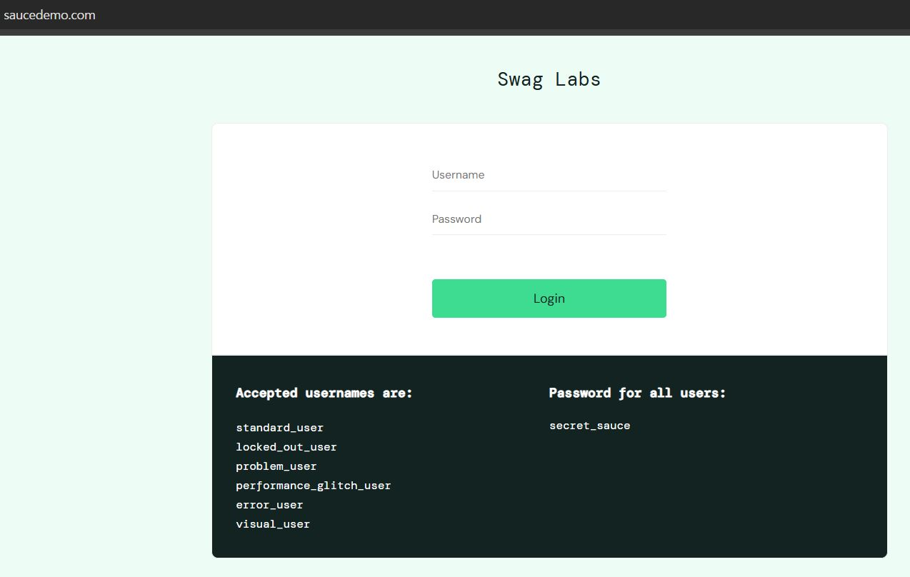
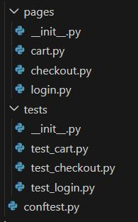
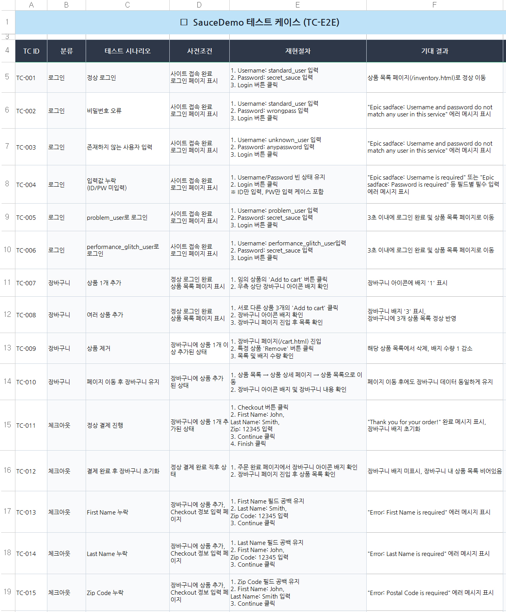
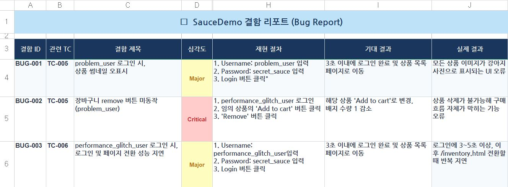
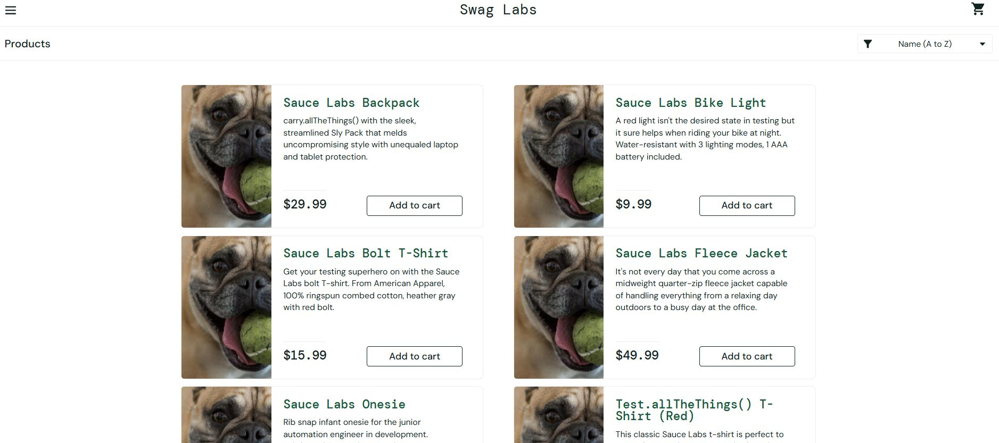
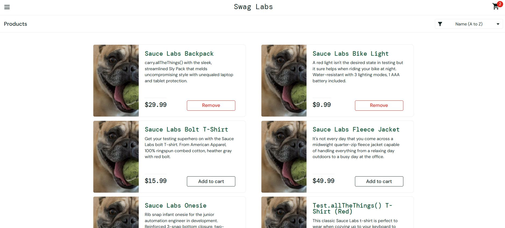

# 이커머스 웹 서비스 기능 테스트 및 자동화


### 🔹 개요
[SauceDemo](https://www.saucedemo.com/) 데모 쇼핑몰 환경에서 로그인·장바구니·체크아웃 흐름에 대한 기능 테스트를 설계·수행하고, 결함 리포트 작성하고 자동화 테스트를 구현했다.

---

### 🔹 목표

- 로그인 기능의 정상/비정상을 자동으로 검증한다.
- 잘못된 계정 정보 및 잠긴 계정 입력 시 적절한 오류 메시지가 출력되는지 확인한다.
- 상품 장바구니 담기·삭제 기능이 정상 동작하는지 검증한다.
- 체크아웃 흐름에서 정상 주문 완료 및 필수값 누락 시 에러 처리가 올바르게 동작하는지 검증한다.
- 주문 완료 후 장바구니 초기화 및 완료 페이지 문구를 자동으로 검증한다.
- 반복 가능한 테스트 환경을 구축하여 수동 테스트의 비효율을 줄인다.
- 실무에서 자주 사용하는 자동화 테스트 구조(POM, fixture, parameterize)를 학습하고 적용한다.
  

---


### 🔹 자동화 시나리오 설계

다음과 같은 사용자 흐름을 기준으로 자동화를 설계

1. https://www.saucedemo.com/ 접속
2. 로그인 테스트 (정상/비정상/경계값)  3개 작성
3. 상품 리스트 확인
4. 장바구니 담기 및 삭제 (장바구니 흐름 테스트)
5. 체크아웃 정보 입력
6. 주문 완료 확인

---

### 🔹 테스트 범위

#### A. 로그인

1. 정상 계정으로 로그인 성공
2. 잘못된 아이디로 로그인 실패
3. 잘못된 비밀번호로 로그인 실패
4. 빈값 입력 (아이디/비밀번호 둘 다)
5. locked_out_user로 로그인 시도
6. 로그인 후 URL 정상 이동 확인

#### B. 장바구니

1. 상품 1개를 장바구니에 담기
2. 상품 여러개 담기
3. 장바구니에서 삭제 후 카운트 확인

#### C. 주문

1. 정상 정보 입력 후 주문 완료
2. 필수 입력값 누락 시 에러 메시지
3. 주문 완료 후 장바구니 초기화 확인
4. 주문 완료 페이지 문구 확인


---
### 🔹 테스트 설계

#### 📂 Page Object Model(POM) 폴더 구조

1. 설계 방식

테스트는 Page Object Model(POM) 구조를 기반으로 설계하였다.



2. 테스트 관점
 - 기능 관점
  로그인 기능이 정상적으로 수행되는가
  상품이 장바구니에 정상적으로 추가/삭제되는가
  체크아웃 프로세스가 정상적으로 완료되는가
 - 입력값 검증 관점
  잘못된 로그인 정보 입력 시 에러 메시지가 출력되는가
  체크아웃 입력값 누락 시 진행이 제한되는가
 - 사용자 경험 관점
  에러 메시지가 명확하고 이해하기 쉽게 제공되는가
  장바구니 및 결제 흐름이 직관적으로 이어지는가

3. 테스트 시나리오
  - 로그인
    1. 정상 로그인
       - 유효한 사용자 계정 입력 (standard_user / password)
       - 메인 상품 페이지 이동 확인
    2. 비밀번호 오류
       - 올바른 ID + 잘못된 비밀번호 입력
       - "Username and password do not match" 메시지 확인
    3. 존재하지 않는 사용자
       - 잘못된 ID 입력
       - 로그인 실패 및 에러 메시지 확인
    4. 입력값 누락
       - ID 또는 비밀번호 미입력
       - 로그인 실패 및 에러 메시지 확인
           
  - 장바구니
    1. 상품 1개 추가
       - 상품 1개 선택 후 "Add to cart" 클릭
       - 장바구니 수량 1 증가 확인
    2. 여러 상품 추가
       - 서로 다른 상품 2개 이상 추가
       - 장바구니 수량 정상 반영 확인
    3. 상품 제거
       - 장바구니에서 상품 제거 클릭
       - 해당 상품 삭제 확인
    4. 장바구니 유지 확인
       - 상품 추가 후 페이지 이동
       - 장바구니 데이터 유지 확인
      
  - 체크아웃
    1. 정상 결제 진행
       - First Name / Last Name / Zip Code 입력
       - 주문 완료 페이지 이동 확인
    2. 필수값 누락 (이름)
       - First Name 미입력
       - "Error: First Name is required" 메시지 확인
    3. 필수값 누락 (성)
       - Last Name 미입력
       - "Error: Last Name is required" 메시지 확인
    4. 필수값 누락 (우편번호)
       - Zip Code 미입력
       - "Error: Postal Code is required" 메시지 확인
    5. 결제 완료 후 상태 확인
       - 주문 완료 후 Thank you for your order! 메시지 확인
       - 장바구니 초기화 확인


---

### 🔹 테스트 케이스




---

### 🔹 자동화 구현 과정

#### 🔎 페이지 객체 설계

**로그인 기능 자동화**

- 정상 로그인
- 잘못된 아이디
- 잘못된 비밀번호
- 빈값 입력

**이커머스 장바구니**

- 상품 담기
- 수량 변경
- 삭제


---

#### 🔎 공통 실행 환경 구성


👉`conftest.py`에서 Pytest fixture를 사용해 Playwright 환경 구성하였다.
    
---

#### 📝 테스트 코드 작성

```python
```


---

| | |
|---|---|
|  |  |


---

### 🔹 결함리포트



| BUG_001 | BUG_002 |
|---|---|
|  |  |

---

### 🔹 결과
- 로그인, 장바구니, 체크아웃에 대해 자동화 테스트 수행
- 정상/비정상 입력 케이스 모두 검증 가능
- 테스트 코드 재사용성과 확장성 확보
- 반복 테스트 수행 시간 단축

👉 페이지 객체, 공통 fixture, 데이터 기반 테스트 구조로 나누어 작성함으로써 재사용성과 가독성을 높인 자동화 구조를 구현했다.

---

### 🔹 아쉬운 점 및 보완점
- 사용자명 조건이 명확하지 않아서 한글이외에 영어, 빈칸, 특수문자등을 사용해도 오류가 없던 점이 개선이 필요
- 비밀번호 조건이 '최소 8자, 숫자포함' 이라고 적혀있어서 영어, 한글, 특수문자, 숫자 어디까지 허용되는지 명확한 명시가 필요
- 로컬 홈페이지를 이용한 프로젝트라서 중복된 이메일, 중복된 사용자를 확인할 수 없는 등의 한계가 존재
- 경계값 테스트 부족 -> 다양한 비밀번호 정책 테스트 추가 필요

---

### 🎯 프로젝트를 통해 배운 점
- Playwright를 활용해 안정적인 테스트 구현
- POM 구조로 유지보수성 확보
- parameterize를 통한 데이터 기반 테스트 구성
- 다양한 예외 케이스를 포함한 테스트 설계

👉 자동화 테스트는 테스트 설계 + 구조 설계 + 유지보수 전략이 중요하다는 것을 학습하였다. Playwright를 활용하면 Selenium 대비 안정적인 테스트 환경을 구축할 수 있다는걸 배웠고, 다양한 입력 검증 시나리오를 데이터 기반으로 설계하여 유지보수 가능한 테스트 구조를 이해하고 POM 구조의 중요성을 실무 관점에서 이해할 수 있었다.

